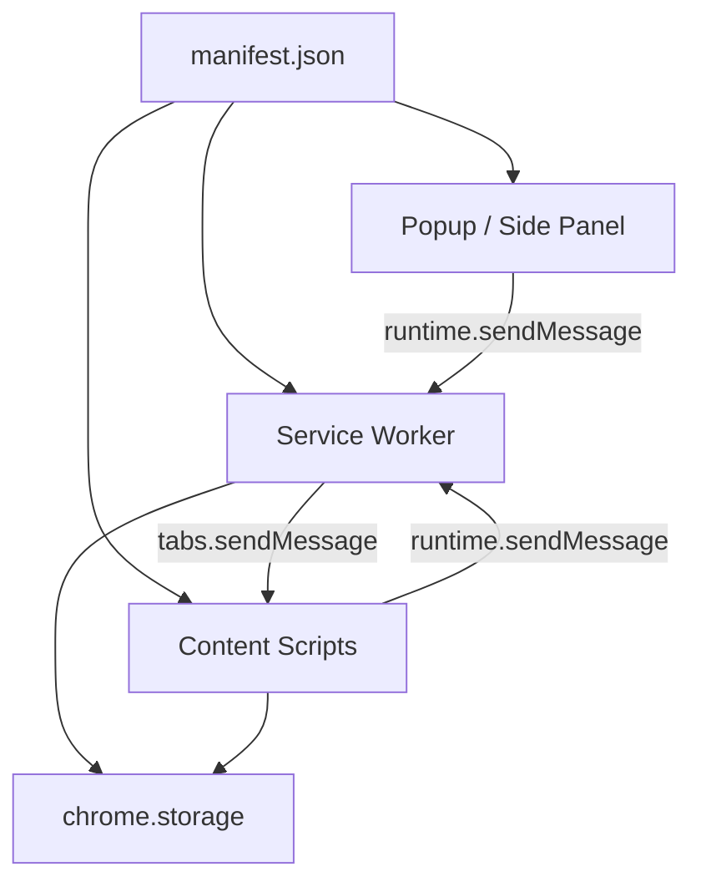

# Chrome Extension (Manifest V3)

## Architecture



- **manifest.json** — the single required file; declares all components, permissions, and resources
- **Service worker** — background event handler; no DOM access; not persistent
- **Content scripts** — run inside web pages; isolated JS context; limited Chrome API access
- **Popup / Side panel** — extension UI pages; full Chrome API access

---

## Manifest V3 Templates

### Minimal

```json
{
  "manifest_version": 3,
  "name": "My Extension",
  "version": "1.0.0",
  "description": "Does one thing well.",
  "icons": {
    "16": "icons/icon-16.png",
    "48": "icons/icon-48.png",
    "128": "icons/icon-128.png"
  }
}
```

### Popup

```json
{
  "manifest_version": 3,
  "name": "My Extension",
  "version": "1.0.0",
  "description": "Extension with a popup.",
  "icons": { "16": "icons/icon-16.png", "48": "icons/icon-48.png", "128": "icons/icon-128.png" },
  "action": {
    "default_popup": "popup.html",
    "default_icon": { "16": "icons/icon-16.png", "48": "icons/icon-48.png" }
  },
  "permissions": ["storage"],
  "host_permissions": ["https://*.example.com/*"]
}
```

### Content Script (auto-injected)

```json
{
  "manifest_version": 3,
  "name": "My Extension",
  "version": "1.0.0",
  "content_scripts": [
    {
      "matches": ["https://*.example.com/*"],
      "js": ["content.js"],
      "css": ["content.css"],
      "run_at": "document_idle"
    }
  ]
}
```

### Side Panel

```json
{
  "manifest_version": 3,
  "name": "My Extension",
  "version": "1.0.0",
  "side_panel": { "default_path": "sidepanel.html" },
  "permissions": ["sidePanel"]
}
```

### Background + Scripting (inject on click)

```json
{
  "manifest_version": 3,
  "name": "My Extension",
  "version": "1.0.0",
  "background": { "service_worker": "sw.js" },
  "action": { "default_title": "Click me" },
  "permissions": ["scripting", "activeTab"]
}
```

---

## Service Worker

Registered via `"background": { "service_worker": "sw.js" }`.

### Key facts

- Event-driven; shuts down after **30 seconds of inactivity** (resets on any event or API call)
- Single request timeout: **5 minutes**
- No DOM access (use [offscreen documents](https://developer.chrome.com/docs/extensions/reference/api/offscreen) if needed)
- No `localStorage` or `sessionStorage` — use `chrome.storage`

### Lifecycle events

```js
// Runs once on install or update
chrome.runtime.onInstalled.addListener((details) => {
  if (details.reason === "install") {
    // First install — set defaults
    chrome.storage.local.set({ count: 0 });
  }
  if (details.reason === "update") {
    // Extension updated — migrate data if needed
  }
});

// Runs when Chrome profile starts (not on every SW wake)
chrome.runtime.onStartup.addListener(() => { /* ... */ });

// Toolbar icon click (when no popup is set)
chrome.action.onClicked.addListener((tab) => { /* ... */ });
```

### Persisting state (critical pattern)

```js
// WRONG — global variables are lost when SW shuts down
let count = 0;
chrome.action.onClicked.addListener(() => { count++; }); // resets to 0 after idle

// CORRECT — persist to storage
chrome.action.onClicked.addListener(async () => {
  const { count = 0 } = await chrome.storage.local.get("count");
  await chrome.storage.local.set({ count: count + 1 });
});
```

### Service worker lifetime (Chrome version notes)

| Chrome | Improvement |
|--------|-------------|
| 110+ | Extension API calls reset the idle timer |
| 114+ | Long-lived port messages keep SW alive |
| 116+ | Active WebSocket connections extend lifetime |
| 118+ | Active `chrome.debugger` sessions keep SW alive |
| 120+ | `chrome.alarms` minimum period reduced to 30s |

---

## Content Scripts

Run inside web pages in an **isolated world** — separate JS context, shared DOM.

### Static injection (manifest)

```json
"content_scripts": [
  {
    "matches": ["https://*.example.com/*"],
    "exclude_matches": ["*://*/*/admin/*"],
    "js": ["content.js"],
    "css": ["content.css"],
    "run_at": "document_idle",
    "all_frames": false
  }
]
```

| `run_at` | When injected |
|----------|---------------|
| `document_idle` | After DOM ready, before/after `window.onload` (default, preferred) |
| `document_start` | After CSS, before any DOM or scripts |
| `document_end` | After DOM complete, before images/frames |

### Dynamic injection (from service worker)

```js
// Register
await chrome.scripting.registerContentScripts([{
  id: "my-script",
  matches: ["*://example.com/*"],
  js: ["content.js"],
  runAt: "document_idle",
  persistAcrossSessions: true,
}]);

// Update
await chrome.scripting.updateContentScripts([{ id: "my-script", excludeMatches: ["*://admin.example.com/*"] }]);

// Remove
await chrome.scripting.unregisterContentScripts({ ids: ["my-script"] });
```

### Programmatic injection (on demand)

```js
// Requires "scripting" + "activeTab" permissions (or host_permissions)
chrome.action.onClicked.addListener((tab) => {
  chrome.scripting.executeScript({
    target: { tabId: tab.id },
    files: ["content.js"],
    // or: func: () => { document.body.style.background = "red"; }
  });
});
```

### Available APIs in content scripts

Content scripts can only directly use: `chrome.dom`, `chrome.i18n`, `chrome.storage`, `chrome.runtime.connect()`, `chrome.runtime.sendMessage()`, `chrome.runtime.getURL()`, `chrome.runtime.id`, `chrome.runtime.onMessage`, `chrome.runtime.onConnect`.

For all other APIs, send a message to the service worker.

### Accessing extension files from content scripts

Declare resources in manifest, then use `chrome.runtime.getURL()`:

```json
"web_accessible_resources": [
  { "resources": ["images/*.png", "fonts/*.woff"], "matches": ["https://example.com/*"] }
]
```

```js
// content.js
const imgSrc = chrome.runtime.getURL("images/logo.png");
```

### Security rules for content scripts

```js
// WRONG — never eval untrusted content
const data = document.getElementById("json-data").textContent;
eval("(" + data + ")");            // dangerous
window.setTimeout("myFn()", 200); // dangerous

// CORRECT
const parsed = JSON.parse(data);
window.setTimeout(() => myFn(), 200);
```

---

## Messaging

### One-time message (content script → service worker)

```js
// content.js — send and await response
const response = await chrome.runtime.sendMessage({ type: "GET_DATA", key: "foo" });
console.log(response);

// sw.js — handle and reply
chrome.runtime.onMessage.addListener((message, sender, sendResponse) => {
  if (message.type !== "GET_DATA") return;

  // Synchronous reply
  sendResponse({ value: "bar" });

  // Async reply — return true to keep channel open
  fetch("https://api.example.com/data")
    .then(r => r.json())
    .then(data => sendResponse(data));
  return true; // required for async sendResponse
});
```

### One-time message (service worker → content script)

```js
// sw.js
const [tab] = await chrome.tabs.query({ active: true, currentWindow: true });
const response = await chrome.tabs.sendMessage(tab.id, { type: "PING" });
```

### Long-lived connection

```js
// content.js — open port
const port = chrome.runtime.connect({ name: "data-channel" });
port.postMessage({ action: "start" });
port.onMessage.addListener((msg) => console.log("from SW:", msg));
port.onDisconnect.addListener(() => console.log("disconnected"));

// sw.js — accept connection
chrome.runtime.onConnect.addListener((port) => {
  if (port.name !== "data-channel") return;
  port.onMessage.addListener((msg) => {
    port.postMessage({ status: "received", echo: msg });
  });
});
```

### Messaging rules

- Messages are **JSON-serialized** (not structured clone) — functions, class instances, `undefined` are lost
- Max message size: **64 MiB**
- Treat messages from content scripts as **untrusted** — validate all input
- `async` listener gotcha: an `async` function that forgets `return` sends `null` to sender

---

## Storage API

Declare `"storage"` in `permissions` to use.

```js
// local — up to 10 MB, device-only
await chrome.storage.local.set({ key: value });
const { key } = await chrome.storage.local.get("key");

// sync — up to 100 KB total / 8 KB per item, synced across devices
await chrome.storage.sync.set({ settings: { theme: "dark" } });
const { settings } = await chrome.storage.sync.get("settings");

// session — up to 10 MB, in-memory, cleared on extension reload/browser restart
await chrome.storage.session.set({ token: "abc" });

// Watch for changes across all areas
chrome.storage.onChanged.addListener((changes, areaName) => {
  for (const [key, { oldValue, newValue }] of Object.entries(changes)) {
    console.log(`[${areaName}] ${key}: ${oldValue} → ${newValue}`);
  }
});
```

| Area | Limit | Cleared when | Best for |
|------|-------|--------------|----------|
| `local` | 10 MB | Extension removed | Large data, local-only |
| `sync` | 100 KB / 8 KB per item | Never (synced) | User preferences |
| `session` | 10 MB | SW restarts / browser closes | Runtime state, tokens |
| `managed` | Read-only | N/A | Enterprise admin config |

---

## Permissions

```json
{
  "permissions": ["storage", "alarms", "contextMenus"],
  "host_permissions": ["https://*.example.com/*"],
  "optional_permissions": ["bookmarks"],
  "optional_host_permissions": ["https://*/*"]
}
```

- `permissions` — API access, granted at install
- `host_permissions` — cross-origin URL access, granted at install (shows warning)
- `optional_permissions` / `optional_host_permissions` — request at runtime via `chrome.permissions.request()`

### Permissions with no install warning (safe to declare)

`storage`, `alarms`, `scripting`, `activeTab`, `contextMenus`, `sidePanel`, `offscreen`, `declarativeContent`, `idle`, `identity`, `sessions`, `search`, `readingList`

### Permissions that show install warnings (use sparingly; prefer `optional_permissions`)

| Permission | Warning shown to user |
|------------|----------------------|
| `tabs` | Read your browsing history |
| `history` | Read and change your browsing history |
| `bookmarks` | Read and change your bookmarks |
| `downloads` | Manage your downloads |
| `notifications` | Display notifications |
| `geolocation` | Detect your physical location |
| `debugger` | Access the page debugger backend + read/change all data on all websites |
| `pageCapture` | Read and change all your data on all websites |
| `clipboardRead` | Read data you copy and paste |

For the full permissions list, see [permissions-ref.md](permissions-ref.md).

---

## UI Patterns

### Popup

Opens when the user clicks the toolbar icon; closes when it loses focus.

```json
"action": {
  "default_popup": "popup.html",
  "default_icon": { "16": "icons/icon-16.png" },
  "default_title": "Open popup"
}
```

`popup.html` is a standard HTML page with full Chrome API access. Keep it lightweight — it's recreated every open.

### Side Panel

Persistent panel alongside the browser window.

```json
"side_panel": { "default_path": "sidepanel.html" },
"permissions": ["sidePanel"]
```

Open programmatically:
```js
chrome.sidePanel.open({ windowId: tab.windowId });
```

### Options Page (embedded)

```json
"options_ui": {
  "page": "options.html",
  "open_in_tab": false
}
```

### Context Menu

```js
// sw.js — create menu item once on install
chrome.runtime.onInstalled.addListener(() => {
  chrome.contextMenus.create({
    id: "my-menu-item",
    title: "Do something with '%s'",
    contexts: ["selection"]
  });
});

chrome.contextMenus.onClicked.addListener((info, tab) => {
  console.log("Selected text:", info.selectionText);
});
```

Requires `"contextMenus"` permission.

---

## Gotchas

| Mistake | Fix |
|---------|-----|
| Global variables in SW reset silently | Persist everything to `chrome.storage` |
| `localStorage` in SW throws | Use `chrome.storage.local` or `chrome.storage.session` |
| CDN `<script src="...">` in popup/pages | Bundle all JS; no remotely hosted code allowed |
| `eval()` of any string | Use `JSON.parse()` and closure-form callbacks |
| `host_permissions` in `permissions` array | Move URL patterns to the separate `host_permissions` key |
| Persistent background page (`"persistent": true`) | Not supported in MV3; service workers only |
| `async` message listener with no `return` | Returns `null` to sender; return a value or `return true` |
| `onInstalled` used for every SW startup | Guard with `details.reason === "install"` |
| Content script accessing `chrome.tabs` | Send a message to SW; content scripts can't call most APIs |
| Web Storage in content scripts | Shares storage with host page; use `chrome.storage` instead |

---

## Dev Workflow

1. Go to `chrome://extensions`
2. Enable **Developer mode** (top right toggle)
3. Click **Load unpacked** → select your extension folder
4. After code changes, click the **refresh icon** on the extension card

**Inspect service worker**: click the "service worker" link on the extension card in `chrome://extensions`

**Inspect popup**: right-click the popup → **Inspect**

**View/edit storage**: DevTools → **Application** tab → **Extension Storage**

---

## Additional Reference

- [manifest-ref.md](manifest-ref.md) — every MV3 manifest key with type and description
- [permissions-ref.md](permissions-ref.md) — full permissions list with install warnings
- [Chrome Extensions API reference](https://developer.chrome.com/docs/extensions/reference/api)
- [Chrome Extensions samples](https://github.com/GoogleChrome/chrome-extensions-samples)

---

## Consistency Automation (Cursor Project Rule)

When working in a new or existing Chrome extension project, create or update a Cursor Project rule to enforce consistent architecture and coding conventions.

### Trigger

Use this whenever:
- Scaffolding a new extension
- Adding major features (new content scripts, service worker flows, side panel/popup)
- Changing manifest permissions or host permissions
- Refactoring messaging or storage patterns

### Action

Create a project rule file at:

`.cursor/rules/chrome-extension-consistency.mdc`

with conventions for:
- Canonical folder structure (`src/background`, `src/content`, `src/popup`, `src/shared`)
- Message schema and naming (`type` constants in shared module)
- Permission hygiene (least privilege, optional permissions preferred)
- Storage schema keys and migration policy
- Prohibited patterns (`eval`, remote scripts, broad host patterns unless justified)
- Required pre-merge checks (extension loads, popup opens, service worker logs clean)

### Rule Template

Use this baseline:

```md
---
description: Chrome extension consistency and safety rules
globs: ["**/*"]
alwaysApply: false
---

# Chrome Extension Consistency Rules

## Architecture
- Keep background logic in `src/background`.
- Keep DOM or page logic in `src/content`.
- Keep UI in `src/popup` or `src/sidepanel`.
- Keep shared contracts and utilities in `src/shared`.

## Messaging
- Define message `type` constants in one shared file.
- Validate inbound message payloads in service worker handlers.
- Do not send functions or class instances in messages; use JSON-safe objects.

## Permissions
- Request minimum required permissions only.
- Prefer `optional_permissions` and `optional_host_permissions` for non-core features.
- Scope host permissions to explicit domains; avoid broad wildcards.

## Storage
- Persist service worker state in `chrome.storage`.
- Define storage keys in a shared constants module.
- Add migration guards for schema and version changes.

## Security
- No `eval`, `new Function`, or remote hosted scripts.
- Avoid injecting unsanitized HTML into extension pages.
- Treat content script input as untrusted and validate it.

## Quality Gate
Before finishing a task:
1. Extension loads in `chrome://extensions`.
2. Service worker starts without runtime errors.
3. Popup or side panel opens and basic actions work.
4. Content script messaging roundtrip succeeds.
```
